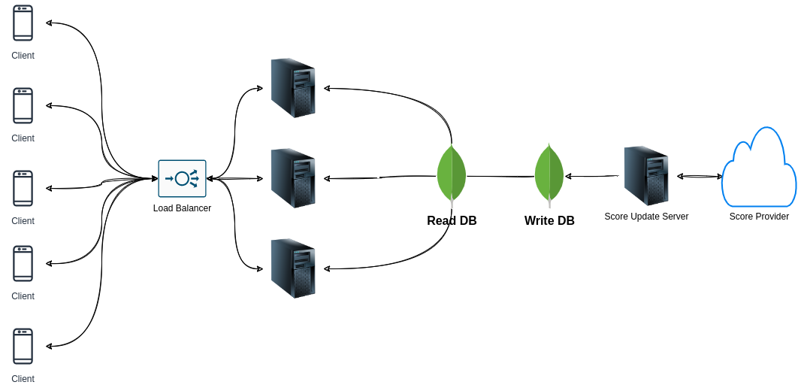

## functional requirements

- User should get list of on going games
- User should get list of past played games
- User should be able to subscribe to specific game
- User should get realtime update of the subscribed game

## Non functional requirements

- Low latency
- should handle high number of traffic

## API design

1. /getLiveGames : GET
   output : list of ongoing live games
2. /history : GET
   input : filters : (date,game category, team Name)
   output : List of games with results

WebSocket

3. /subscribe/:gameId
   input : id of the game
   output : live updates of the game

## Block Diagram

