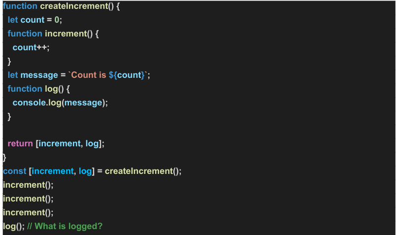

Output will be
> Count is 0

1. The log function simply prints **message** variable
2. this message variable comes from outer scope and **initialized** at the time of **object creation**
3. when it was initialized value of **count was 0**
4. when increment function is called count is  being increased but message variable is remaining the same.

